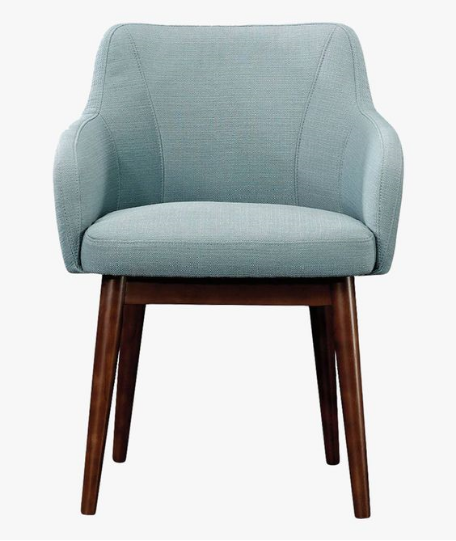

# My App Project 🚀

Welcome to the My App Project! This project is built using React Native and aims to provide a seamless user experience with a variety of interactive elements.




## Project Overview
My App is a mobile application designed to enhance user engagement through interactive features. It allows users to browse products, manage their cart, and make purchases seamlessly.

## Technologies Used
- **React Native**: For building the mobile application.
- **Expo**: For rapid development and deployment.
- **Firebase**: For backend services and real-time database.

## Installation Instructions
To get started with the project, follow these steps:
1. Clone the repository:
    ```bash
    git clone https://github.com/yourusername/my-app.git
    cd my-app
    ```
2. Install dependencies:
    ```bash
    npm install
    ```
3. Run the app:
    ```bash
    npm start
    ```

## Usage
- **Browse Products**: Users can view a list of available products.
- **Manage Cart**: Users can add or remove items from their cart.
- **Checkout**: Users can complete their purchases through a secure checkout process.

## Features ✨
- **Interactive UI**: Smooth and responsive user interface.
- **Customizable Components**: Easily customizable components to fit your needs.
- **Cross-Platform**: Works on both iOS and Android devices.

## Contributing 🤝
We welcome contributions! Please read our [contributing guidelines](CONTRIBUTING.md) before submitting a pull request.

## License 📄
This project is licensed under the MIT License. See the [LICENSE](LICENSE) file for details.

## Contact 📧
If you have any questions, feel free to reach out to us at [support@myapp.com](mailto:support@myapp.com).

Happy coding! 🎉
